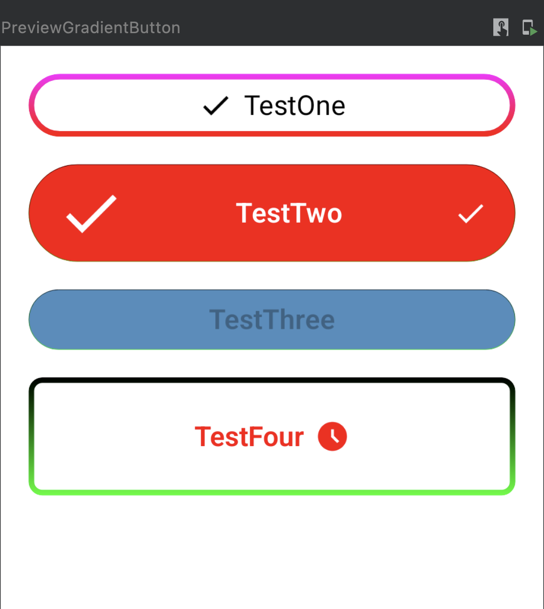

# Gradient Boarder Button For Android

This button will allow you to make the boarder (strock) gradient and it has more customization that
native android button we will discuss all the availabile customization in details below, Thank you.

## Screenshot



## Setup Your Project

first start by addin this configration to your build.gradle(app) level

```
  //In android {} block add this lines

   buildFeatures {
        compose true
    }

    composeOptions {
        kotlinCompilerExtensionVersion = "1.3.2"
    }

    packagingOptions {
        resources {
            excludes += "META-INF/**"
        }
    }

```

Then in depedanices block add this lines

```
    //Compose Dependencies
    def composeBom = platform('androidx.compose:compose-bom:2022.12.00')
    implementation composeBom
    implementation 'androidx.compose.material:material'

    // Android Studio Preview support
    implementation 'androidx.compose.ui:ui-tooling-preview'
    debugImplementation 'androidx.compose.ui:ui-tooling'

```

Then copy all the files to your project

1- Copy CustomGradientButton file\
2- Copy these attrs to your values/attrs.xml:

```
<declare-styleable name="CustomButton">
        <attr name="textTitle" format="string" />
        <attr name="textColor" format="color" />
        <attr name="topBoarderColor" format="color" />
        <attr name="bottomBoarderColor" format="color" />
        <attr name="buttonBackground" format="color" />
        <attr name="borderRound" format="integer" />
        <attr name="buttonBorderWidth" format="integer" />
        <attr name="innerVerticalPadding" format="integer" />
        <attr name="innerHorizontalPadding" format="integer" />
        <attr name="buttonTextSize" format="integer" />
        <attr name="isEnabled" format="boolean" />
        <attr name="iconsArrangement">
            <enum name="center" value="0" />
            <enum name="spaceBetween" value="1" />
        </attr>
        <attr name="fontWidth">
            <flag name="veryLight" value="200"/>
            <flag name="light" value="300"/>
            <flag name="normal" value="400"/>
            <flag name="semiBold" value="500"/>
            <flag name="bold" value="600"/>
            <flag name="veryBold" value="800"/>
        </attr>
        <attr name="startIconRes" format="reference"/>
        <attr name="startIconSize" format="integer"/>
        <attr name="startIconPadding" format="integer"/>
        <attr name="endIconRes" format="reference"/>
        <attr name="endIconSize" format="integer"/>
        <attr name="endIconPadding" format="integer"/>
    </declare-styleable>

```

Now you are ready to use it inside your layout files like this:

```

    <com.maf.custom.views.CustomGradientButton
        android:id="@+id/custom_button"
        android:layout_width="match_parent"
        android:layout_height="wrap_content"
        app:textTitle="Click Here !"
        app:textColor="#000"
        app:topBoarderColor="@color/black"
        app:bottomBoarderColor="@color/teal_200"
        app:innerVerticalPadding="15"
        app:borderRound="15"
        app:buttonBorderWidth="2"
        app:buttonBackground="#fff"
        app:buttonTextSize="18"
        app:isEnabled="true"
        app:fontWidth="semiBold"
        app:startIconRes="@drawable/baseline_done_24"
        app:startIconPadding="60"
        app:startIconSize="50"
        app:endIconPadding="60"
        app:innerHorizontalPadding="20"
        app:iconsArrangement="spaceBetween"
        app:endIconRes="@drawable/baseline_done_24"
        />

```

## Documentation

Now lets walk through the available customizations:

| Attribute              | Type              | Description                                                             | Values                                                                                               |
|------------------------|-------------------|-------------------------------------------------------------------------|------------------------------------------------------------------------------------------------------|
| textTitle              | String            | The text displayed in the button                                        | Any String value or resource -> default: null                                                        |
| textColor              | Color             | Color for the text displayes in the button                              | Any Color value or resource -> default: Black                                                        |
| topBoarderColor        | Color             | Color for the start of gradient                                         | Any Color value or resource -> default: White                                                        |
| bottomBoarderColor     | Color             | Color for the end of gradient                                           | Any Color value or resource -> default: White                                                        |
| buttonBackground       | Color             | Button Background Color                                                 | Any Color value or resource -> default: White                                                        |
| roundedBoarder         | Int               | Make the button with rounded corners                                    | Values between 0-100 -> default: 0                                                                   |
| buttonBorderWidth      | Int               | The width of button boarder                                             | Any Int value -> default: 0                                                                          |
| innerVerticalPadding   | Int               | Top and Bottom inner padding for the button                             | Any Int value -> default: 10                                                                         |
| innerHorizontalPadding | Int               | Right and Left inner padding for the button                             | Any Int value -> default: 20                                                                         |
| buttonTextSize         | Int               | Button text size                                                        | Any Int value -> default: 14                                                                         |
| isEnabled              | Boolean           | Make the button disabled if false will make the button alpha value 0.3f | true/false -> default: true                                                                          |
| startIconRes           | Drawable Resource | Add icon on the left of the text                                        | Any drawable resource -> default: null                                                               |
| startIconSize          | Int               | Left icon size if there is one                                          | Any Int value -> default: 25                                                                         |
| startIconPadding       | Int               | Padding between the left icon and the text                              | Any Int value -> default: 8                                                                          |
| endIconRes             | Drawable Resource | Add icon on the right of the text                                       | Any drawable resource -> default: null                                                               |
| endIconSize            | Int               | Right icon size if there is one                                         | Any Int value -> default: 25                                                                         |
| endIconPadding         | Int               | Padding between the left icon and the text                              | Any Int value -> default: 8                                                                          |
| iconsArrangement       | Enum              | How to arrange icons with the text in the button                        | Choose between two values (center, spaceBetween) -> default: center                                  |
| fontWidth              | Enum              | The weight of the font                                                  | Choose between these values  (veryLight, light, normal, semiBold, bold, veryBold) -> default: normal |

Also all these values are changable from the code like this:

```
    binding.customButton.borderRound = 0.dp
    //and all the customization are available

```

Finally to make a click listener do this:

```
    binding.customButton.onClick = {
        binding.customButton.buttonEnabled = false
    }

```

### That's it :).

## Sorry for any bad practices in the code, I will be happy for any suggetion to improve the code, Thank you.

